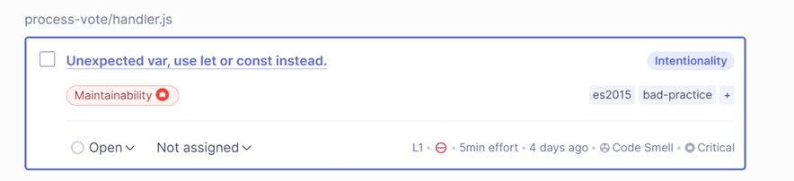

# SonarQube Lab _:smile:_

## Descricción

Implementación de la plataforma SonarQube en un contenedor de docker para realizar la evaluación de código de un repositorio en local.

**_Nota:_** Se evaluo el siguiente codigo [Voting-App](https://github.com/JhormanMera/serverless-voting-app/tree/master)

## Requisitos

- Docker en el sistema operativo donde se llevara acabo el analisis

## Instalación SonarQube

**_Nota:_** Se puede instalar SonarQube de dos formas:

1. Con Docker

`docker run -d --name sonarqube -p 9000:9000 -v sonarqube_data:/opt/sonarqube/data sonarqube`

2. Con un Docker Compose

```
version: '2'

services:
  sonarqube:
    image: sonarqube
    ports:
      - "9000:9000"
    networks:
      - sonarnet
    environment:
      - SONARQUBE_JDBC_URL=jdbc:postgresql://db:5432/sonar
      - SONARQUBE_JDBC_USERNAME=sonar
      - SONARQUBE_JDBC_PASSWORD=sonar
    volumes:
      - sonarqube_conf:/opt/sonarqube/conf
      - sonarqube_data:/opt/sonarqube/data
      - sonarqube_extensions:/opt/sonarqube/extensions
      - sonarqube_bundled-plugins:/opt/sonarqube/lib/bundled-plugins

  db:
    image: postgres
    networks:
      - sonarnet
    environment:
      - POSTGRES_USER=sonar
      - POSTGRES_PASSWORD=sonar
    volumes:
      - postgresql:/var/lib/postgresql
      - postgresql_data:/var/lib/postgresql/data

networks:
  sonarnet:
    driver: bridge

volumes:
  sonarqube_conf:
  sonarqube_data:
  sonarqube_extensions:
  sonarqube_bundled-plugins:
  postgresql:
  postgresql_data:
```

Recuerde que este archivo de docker-compose se ejecunta con `docker-compose up`


## En SonarQube

Se ingresa al sonarqube por la url `localhost:9000`, las credenciales de autenticación por defecto son Login: admin y Password: admin

Luego se realiza el cambio de contraseña que solicita, (se siguen los pasos que indica el software.)

Ahora bien, se crea un proyecto local, cabe destacar que se pueden crear proyectos con repositorios fuentes desde diferentes plataformas como Azure DevOps, Github, Gitlab y Bitbucket. Pero recordemos que este apartado sera de un proyecto local.


Generar el token de autenticación para realizar los análisis de código del proyecto y luego seleccionamos el sistema operativo donde ejecutaremos el Sonar-Scanner para realizar la instalación de su CLI

**_Nota:_** Este token solo es válido en este proyecto, también se puede crear un token global desde la configuración de la cuenta.

## Instalar Sonar-Scanner en Linux

**_Nota:_** Antes de continuar se debe instalar Sonar-Scanner en el sistema y agregarlo a las variables de entorno del mismo

Para esta parte, es necesario tener `wget` y `unzip` instalados los cuales se pueden instalar ejecutando `

```
sudo apt update
sudo apt upgrade
sudo apt install wget
sudo apt install unzip
```

Se procede a descargar Sonar-Scanner desde la documentación oficial y a descomprimir la carpeta comprimida de la última versión de Sonar-Scanner

Ejecutar el escaner dentro de la carpeta raiz del proyecto y esperar que se realicen las verificaciones hasta que se recargue la página del dashboard y se muestre el resultado del análisis

**_Nota:_** Este comando lo facilita sonarqube, solo hay que copiar y pegar. Teniendo en cuenta que el token es unico.


De esta forma se procede a evaluar el codigo fuente. SonarQube tiene la capacidad de mostrar alertas en el código y dar recomendaciones para corregirlo seguido de una explicación detallada de todo el análisis

En este caso se evidencia que el codigo fuente tiene posibilidades de mejora, buenas practicas y criterios de ciberseguridad.





## <b> Made by </b>

+ [Camilo González Velasco](https://github.com/camilogonzalez7424 "Camilo G.")


[](https://forthebadge.com)